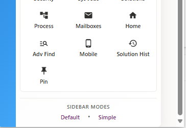
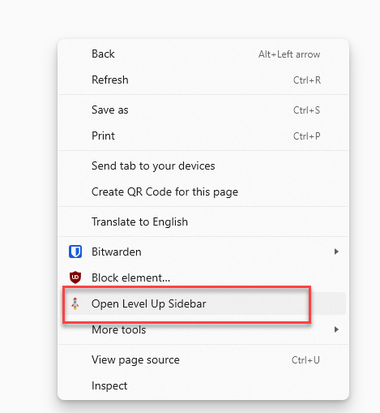
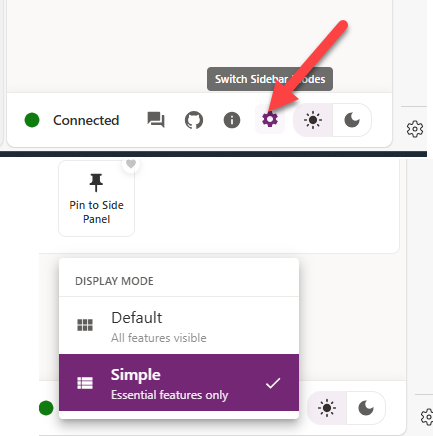
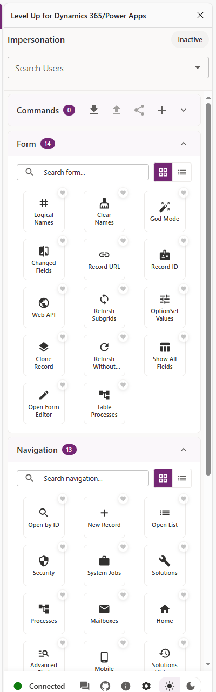
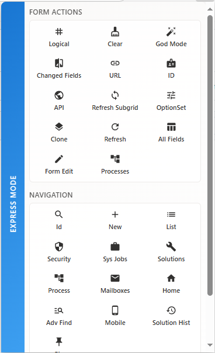

# Level Up for Dynamics 365/Power Apps

Level Up is a browser extension that helps Dynamics 365, Power Apps, and web teams work more efficiently. It provides quick admin actions, custom command execution, UI utilities, and diagnostic tools in a compact sidebar or popup.

# Extension Modes

There are two modes in the extension: Sidebar mode and Express Mode. When you click on the extension button, the popup you see is the Express Mode. Below is a summary of what is available in Sidebar mode and Popup mode.

| Sidebar Mode | Express Mode |
|--------------|--------------|
| 1. Impersonation 2. Form Actions 3. Navigation Actions 4. Custom Commands 5. Debugging Actions 6. Dark Theme/Light Theme switcher | 1. Form Actions 2. Navigation Actions |

You can launch Sidebar from the popup by clicking the links in the bottom.

You can also launch it from the Right Click Context Menu.

Sidebar has two modes: Default and Simple.

If you choose Simple, you will get the same functionalities like the Popup. Impersonation is available only in the Default mode.

Below are screenshots of the extension displayed side-by-side for quick comparison.

<table>
  <tr>
    <td align="center"><b>Sidebar (full-featured UI)</b></td>
    <td>&nbsp;</td>
    <td>&nbsp;</td>
    <td align="center"><b>Popup (compact UI)</b></td>
  </tr>
  <tr>
    <td align="center"></td>
    <td>&nbsp;&nbsp;</td>
    <td>&nbsp;</td>
    <td align="center"></td>
  </tr>
</table>

# Functions

The extension organizes actions into different categories accessible through the sidebar UI or a minimal popup UI.

## Form Actions

| #   | Action                   | Description                                                                                      |
| --- | ------------------------ | ------------------------------------------------------------------------------------------------ |
| 1   | **Logical Names**        | Show logical names for all fields and tabs on the form                                           |
| 2   | **Clear Names**          | Hide logical names and restore original field labels                                             |
| 3   | **God Mode**             | Make all fields visible and editable regardless of security roles                                |
| 4   | **Changed Fields**       | Highlight fields that have been modified on the current form                                     |
| 5   | **Record URL**           | Copy the current record URL to clipboard                                                         |
| 6   | **Record ID**            | Copy the current record GUID to clipboard                                                        |
| 7   | **Web API**              | Open Web API endpoint for this record in a new tab                                               |
| 8   | **Refresh Subgrids**     | Refresh all subgrids on the current form                                                         |
| 9   | **OptionSet Values**     | View all option set values and their numeric codes                                               |
| 10  | **Clone Record**         | Create a duplicate of the current record with all field values                                   |
| 11  | **Refresh Without Save** | Refresh the form without auto-saving changes                                                     |
| 12  | **Show All Fields**      | View all fields and their values in a searchable table                                           |
| 13  | **Open Form Editor**     | Open the form editor to modify the form layout                                                   |
| 14  | **Table Processes**      | View workflows, business rules, business process flows, custom APIs, and actions for this entity |

## Navigation Actions

| #   | Action                | Description                                       |
| --- | --------------------- | ------------------------------------------------- |
| 1   | **Open by ID**        | Open a specific record by entering its GUID       |
| 2   | **New Record**        | Create a new record by selecting entity type      |
| 3   | **Open List**         | Navigate to a list view for any entity            |
| 4   | **Security**          | Access security roles and permissions settings    |
| 5   | **System Jobs**       | View and monitor system jobs and workflows        |
| 6   | **Solutions**         | Access solution management and customizations     |
| 7   | **Processes**         | Manage business processes and workflows           |
| 8   | **Mailboxes**         | Configure email settings and mailbox status       |
| 9   | **Home**              | Navigate to the main Dynamics 365 homepage        |
| 10  | **Advanced Find**     | Open advanced search and query builder            |
| 11  | **Mobile**            | Access the mobile client interface                |
| 12  | **Solutions History** | View history of solution imports and changes      |
| 13  | **Pin to Side Panel** | Pin the current page to the side navigation panel |

## Debugging Actions

| #   | Action                     | Description                                                |
| --- | -------------------------- | ---------------------------------------------------------- |
| 1   | **Forms Monitor**          | Monitor form events and script executions in real-time     |
| 2   | **Command Checker**        | Debug ribbon commands and check their availability rules   |
| 3   | **Perf Center**            | Analyze form performance and identify slow operations      |
| 4   | **Disable Form Handlers**  | Temporarily disable all form event handlers for debugging  |
| 5   | **Disable Business Rules** | Temporarily disable all business rules on the current form |
| 6   | **Disable Form Libraries** | Temporarily disable all form JavaScript libraries          |
| 7   | **Enable Dark Mode**       | Enable dark mode theme for Dynamics 365 interface          |
| 8   | **Clear Flags**            | Clear all debugging flags and restore normal behavior      |

## Additional Features

- **🎭 User Impersonation**: Act on behalf of other users (requires System Administrator privileges)
- **⚡ Custom Commands**: Execute custom JavaScript commands and scripts
- **🔧 Extension Configuration**: Switch between Default and Simple Sidebar modes.

## Credits
* Bob Guidinger's original idea on Impersonation
* Ivan Ficko for the original PR in v3 that added impersonation capability to Level up
* [Rocket Icon by Jerry Low](https://www.iconfinder.com/jerrylow)
